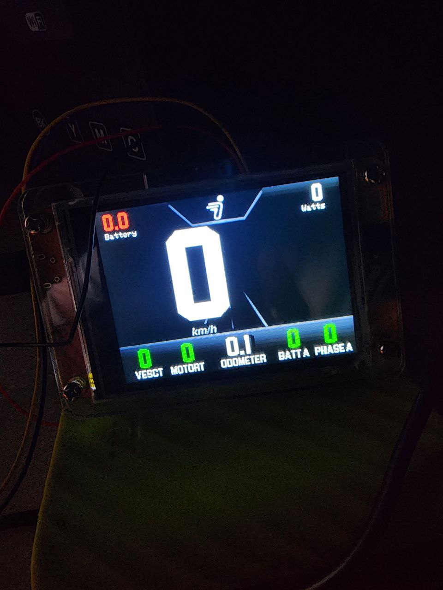

# 🚀 Simple VESC Display for ESP32-2432S028R

> **Credits:** Based on the original project by [Gh0513d/SVD](https://github.com/Gh0513d/SVD) 🔗

This is a modified version of the VESC display project, optimized for the **ESP32-2432S028R** display. The goal is to enhance functionality and add new features while keeping it simple and efficient.

## 🎨 Demo



## ✨ Features

✅ Real-time speed, RPM, and power display  
✅ Optimized data calculations similar to VESC Tool  
✅ Trip and total distance tracking  
✅ EEPROM storage for trip data  
✅ Automatic brightness control using LDR sensor  
✅ High-speed UART communication with VESC  
✅ Overheating and battery warnings  
✅ PNG image support for custom UI background and startup logo  

## 📥 Installation

Follow these steps to set up the project on your ESP32-2432S028:

### 1️⃣ Install Arduino IDE & ESP32 Board Support
- Download and install the latest [Arduino IDE](https://www.arduino.cc/en/software).
- Open **Arduino IDE** and go to **File** > **Preferences**.
- In the "Additional Board Manager URLs" field, add:
  ```
  https://raw.githubusercontent.com/espressif/arduino-esp32/gh-pages/package_esp32_index.json
  ```
- Go to **Tools** > **Board** > **Boards Manager**, search for "ESP32," and install the latest ESP32 board package.

### 2️⃣ Install Required Libraries
- Extract the `libraries.zip` file into your Arduino libraries folder (`Documents/Arduino/libraries/`).
- If you prefer manual installation, ensure you have the following libraries installed:
  - **TFT_eSPI** (for display control)
  - **FlickerFreePrint** (for flicker-free text rendering)
  - **ComEVesc** (for VESC communication)
  - **PNGdec** (for PNG image decoding)
  - **EEPROMAnything** (for EEPROM read/write support)

### 3️⃣ Flash the Code to ESP32
- Open the `vesc_display.ino` file in **Arduino IDE**.
- Select the correct board: **ESP32 Dev Module**.
- Set the correct **COM Port**.
- Click **Upload** and wait for the process to complete.

## 🔧 Configuration

Before compiling, you may need to tweak some settings (if you install tft_espi byself):
- **`User_Setup.h`** in the `TFT_eSPI` library to match your display pinout.
- Adjust motor and wheel parameters in the `main.ino` file.

## 🚀 Coming Soon

🔹 More UI customization options (with new library instead as tft_espi :D) 🎨  
🔹 BLE and WiFi bridge 🌐  
🔹 Improved data logging & visualization 📊  
🔹 Add CANBUS support for better and reliable communication  

## 🤝 Contributing

Feel free to fork the project and submit pull requests. Suggestions and improvements are always welcome! 😊

## 📜 License

This project is open-source and licensed under the **MIT License**.

---

Happy coding! 🚀
